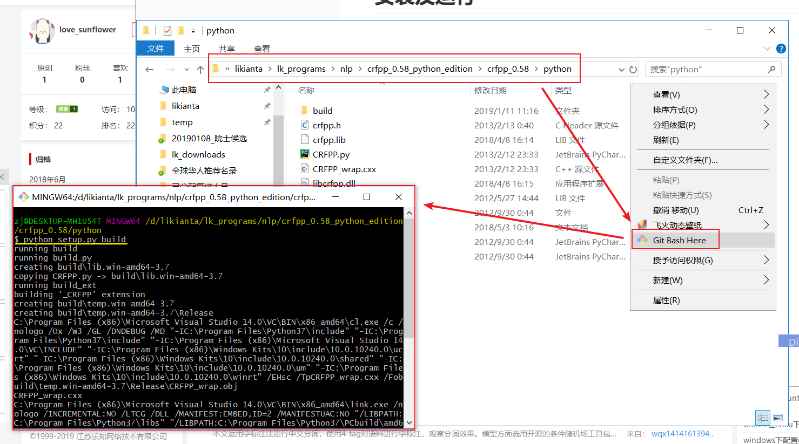
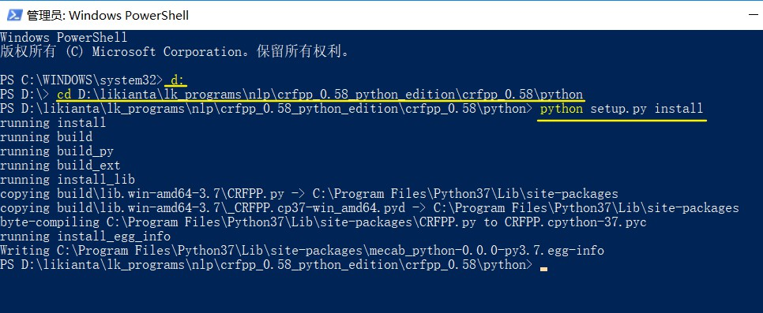

# 安装及运行

本软件为国内大神 [wang_kill](https://download.csdn.net/download/wang_kill/10429013) 封装的软件包, 软件本体为crfpp_0.58, wang对其增加了python的安装对接.

注意事项: 只适合windows x64用户安装.

**安装方法:**

cd到软件目录, 依次输入命令 `python setup.py build`, `python setup.py install`

如图所示:

ps: `python setup.py install` 有可能会遇到权限不足的问题, 因此我换用管理员模式安装了:

**参考:**

- https://blog.csdn.net/dan920604/article/details/80775272
